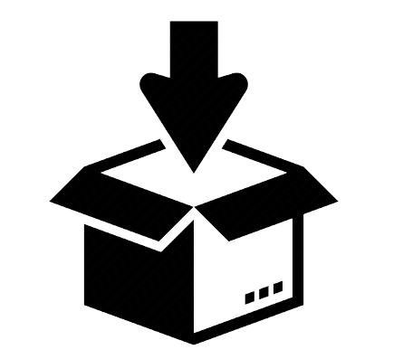

## StashDiv

**A browser extension to remove any div/element from a webpage**

*Please wait for the demo video to load :)*

### How it works

it stores the xpath of all the elements in the local
[chrome storage](https://developer.chrome.com/docs/extensions/reference/storage/) and then when a page is loaded it finds all the elements using the xpath and sets the `visibility` of element to `hidden`
